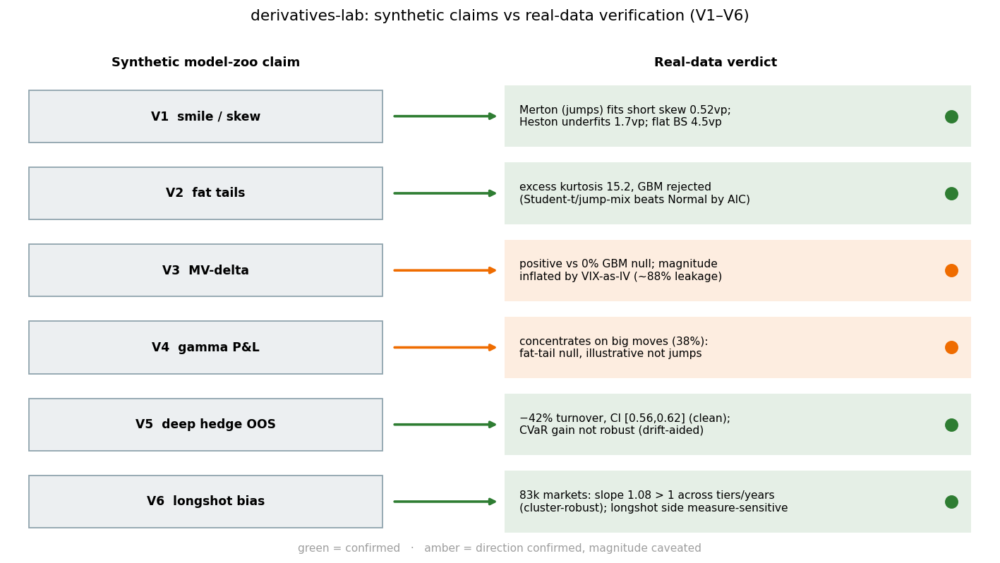
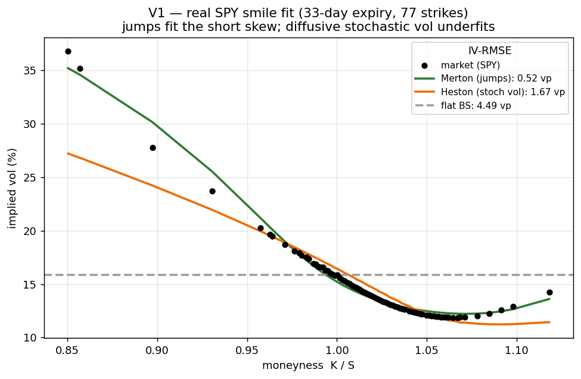
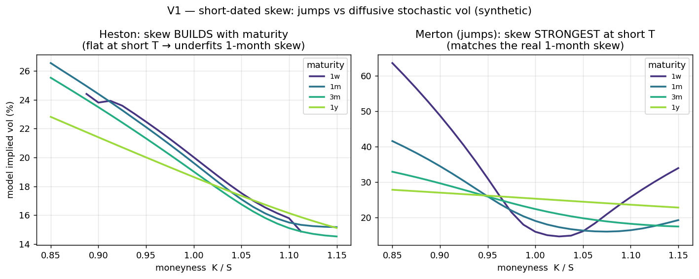
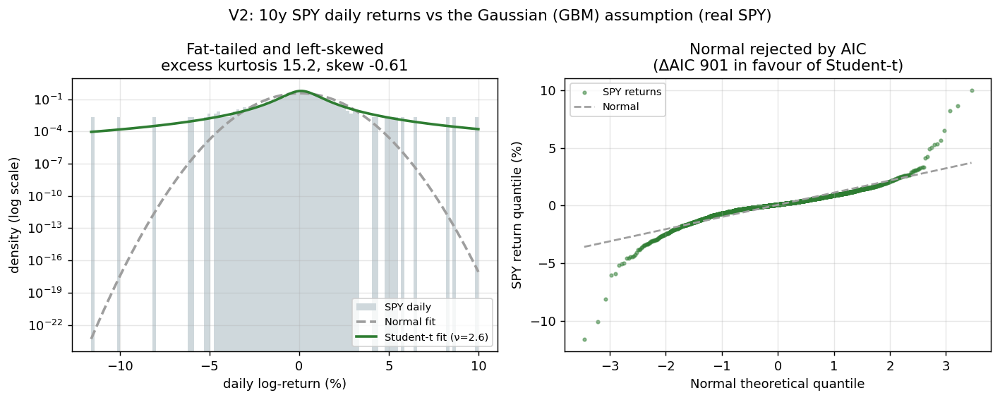
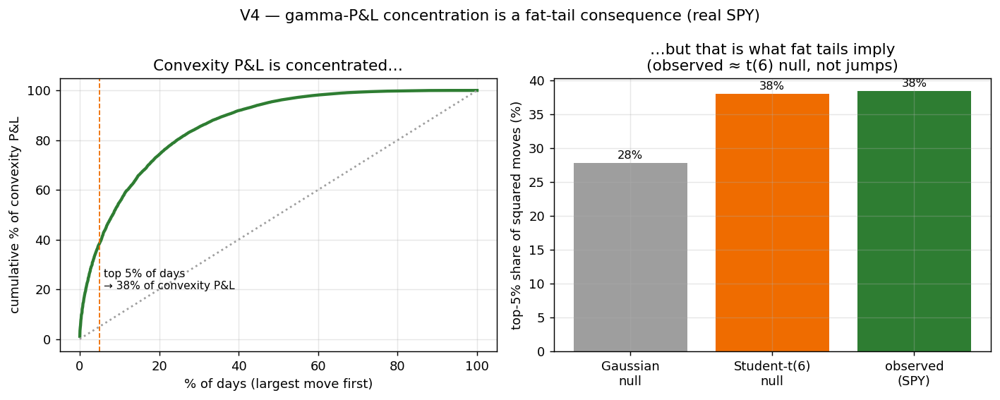
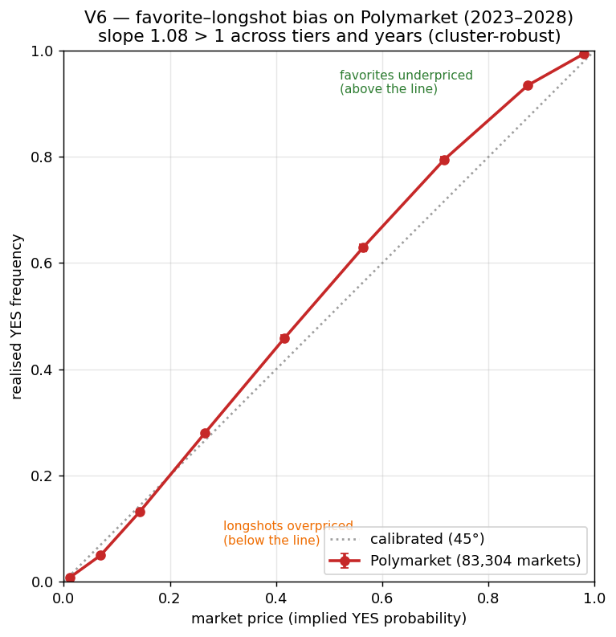

# Real-Data Verification of the Model Zoo

Every pricing and hedging claim in this lab was first established in **synthetic worlds**
(GBM, Merton jump-diffusion, Heston). This report records what happens when the
load-bearing claims are tested against **real market data**. The goal is not to re-derive the
models but to check that their qualitative predictions survive contact with reality, and to
be honest about where they don't.

This is a **verification** exercise, not a discovery. The phenomena here (fat tails, the
jump-driven short skew, the leverage effect, the favorite–longshot bias, the deep-hedge
turnover saving) are all well-established in the literature. The contribution is the
rigorous, reproducible re-test on real data and the explicit accounting of where each
textbook claim holds, where its *magnitude* is inflated by construction, and where it is
merely a consequence of something simpler.

## Method & reproducibility

- **Data:** `yfinance` only (a declared dependency). One dated snapshot per series, taken
  **2026-06-20**: SPY option chain (V1), 10y daily SPY (V2, V5), 10y daily SPY + `^VIX` (V3).
- **Reproducibility:** every fetch is pinned to a dated parquet under `data/cache/`
  (gitignored) via `data/fetcher.fetch_and_cache`. After the first fetch the notebooks run
  **offline and deterministically**. CI runs only `tests/`, never these notebooks.
- **Notebooks:** [`research/04_real_smile_calibration.ipynb`](../research/04_real_smile_calibration.ipynb)
  (V1), [`research/05_real_returns_jumps.ipynb`](../research/05_real_returns_jumps.ipynb) (V2),
  [`research/06_mv_delta_hedging.ipynb`](../research/06_mv_delta_hedging.ipynb) (V3),
  [`research/07_real_gamma_attribution.ipynb`](../research/07_real_gamma_attribution.ipynb) (V4),
  [`research/08_deep_hedge_oos.ipynb`](../research/08_deep_hedge_oos.ipynb) (V5),
  [`research/09_pm_longshot.ipynb`](../research/09_pm_longshot.ipynb) (V6).
- **V6** uses the **SII-WANGZJ/Polymarket_data** HuggingFace dump (`markets.parquet` for outcomes,
  `trades.parquet` for prices via remote DuckDB), not yfinance.

## Summary

| # | Synthetic claim | Real-data result | Verdict |
|---|---|---|---|
| **V1** | Real option smiles are skewed/fat-tailed; jump & stoch-vol models bend, flat BS can't | Merton IV-RMSE **0.52 vp**, Heston **1.67 vp** (underfits even at full DE budget, degenerate params), BS flat **4.49 vp**, all on 77 strikes | ✅ jumps win the short skew (illustration) |
| **V2** | Real returns are non-Gaussian (fat tails, left skew) | excess kurtosis **15.2**, skew **−0.61**, Jarque–Bera rejects Normal (p≈0); a fat-tailed model (Student-t / jump-mixture) beats Normal by AIC | ✅ GBM rejected |
| **V3** ★ | Minimum-variance delta should help where real spot-vol leverage exists (synthetic null **0%**) | OOS variance reduction **≈49%**, but ~88% of it is VIX-as-IV leakage; vs **0%** GBM null and Hull–White 2017 **~26%** on real quotes | ✅ direction; magnitude inflated |
| **V4** | Delta-only hedge is short gamma; losses concentrate on big moves | top 5% move-days carry **38%** of convexity P&L, but a Student-t(6) null already gives ~38% | ✅ illustrative (not jump evidence → V2) |
| **V5** | The deep hedger's cost/turnover edge isn't a synthetic artefact | OOS **−42% turnover** (ratio 0.58, 95% CI [0.56, 0.62], clean); CVaR₅ +11% point estimate but not robust (drift-aided) | ✅ cost/turnover channel real |
| **V6** | Prediction-market prices are biased vs realised frequency (Q-vs-P) | **83k markets (2023–2028)**: longshots (p<0.10) priced **2.3%** resolve **1.6%**; favorites (p>0.90) **96.4%→98.8%**; slope **1.08** (cluster-robust, 95% CI [1.07, 1.10]) > 1 across tiers and years; longshot side measure-sensitive | ✅ favorite-longshot bias |

---

## V1: Implied-volatility smile

**Setup.** SPY call chain (S≈746.74), liquid quotes only, representative ~33-day expiry,
moneyness ∈ [0.85, 1.15] (liquid quotes reach 1.12 on this snapshot). Fit Merton `(σ,λ,μ_J,δ_J)` by least squares on IV; calibrate Heston
`(κ,θ,ξ,ρ,v₀)` with `HestonCalibrator`; flat BS pinned at ATM IV.

**Result.** The real 33-day smile is steep and downward-skewed (slope ≈ −0.88), fit on all 77
liquid strikes. **Merton fits it tightly (0.52 vol pts)** with λ≈0.96/yr and a mean down-jump
≈ −14%. **Heston bends the right way (ρ≈−0.82) but underfits (1.67 vol pts at the full DE
budget):** its diffusive skew builds with maturity, so matching a one-month skew this steep forces
a near-degenerate fit (v₀ pinned at its bound, θ≈0.28). The full DE budget does not lower it,
confirming a structural short-maturity limit. **Flat BS (4.49 vp)** misses the wings entirely. On
real data the **jump** mechanism explains the short-dated equity skew better than diffusive
stochastic vol.

**Caveats.** SPY options are American and the index pays dividends (~1.3%/yr → only a few bp of
ATM-IV bias over 33 days; we also drop the deep wings). Heston's miss is structural, not an
optimiser failure (verified at full DE budget). This is an **illustration**: one snapshot, one
expiry, 77 strikes, Merton fits 4 params to 77 IV points, no CIs, not a calibrated benchmark.

## V2: Fat tails & jumps in returns

**Setup.** 10y of daily SPY log-returns (2513 obs). Moments + Jarque–Bera; Merton fit by
maximum likelihood (Poisson-weighted Normal density) vs a plain Normal, compared by AIC.

**Result.** **Excess kurtosis 15.2** and **skew −0.61**; Jarque–Bera rejects normality at any
level (p≈0). A fat-tailed model beats the Normal decisively by AIC, a 3-param **Student-t
(AIC −16274, df≈2.6)** even edges out the 5-param Merton (−16224), both far below Normal
(−15373). **GBM is rejected.** But the fitted Merton λ≈81/yr (δ_J≈1.6% on ~27% of days)
describes *high-frequency micro-perturbations / fat tails*, not the rare large gaps of V1's
Q-measure smile fit. Same conclusion, different mechanism.

**Caveats.** This is the **physical (P) measure**, not the risk-neutral (Q) smile fit of V1:
MLE on daily returns favours *many small* jumps (λ≈81/yr), whereas the smile favours *rarer,
larger* down-jumps. The jump/diffusion split is not sharply identified at daily frequency,
and real volatility clustering (not in Merton) also contributes to the kurtosis. The robust
conclusions are the stylised facts and the decisive AIC gap, not the exact λ.

## V3 ★: Minimum-variance delta hedging

**Setup (reproducible, no option panel).** Daily SPY + `^VIX` as the ATM ~1-month IV proxy.
Each day strike a fresh ATM 1-month call at `S_t`, `IV=VIX_t`; one-day delta-hedged P&L
`HE = ΔC − δ·ΔS`. BS delta `N(d₁)`; Hull–White MV delta
`δ_MV = δ_BS + (vega/(S√τ))(a + b·δ_BS + c·δ_BS²)`, with `(a,b,c)` fit by least squares.
Gain `= 1 − Var(HE_MV)/Var(HE_BS)`, reported in-sample and out-of-sample (fit first half).

**Result.** Strong leverage effect (ΔVIX vs return correlation ≈ −0.79). MV-delta cuts
hedging-error variance by **≈49% out-of-sample** (54% in-sample). **But ~88% of the hedging
error is the vol-move term (vega·ΔVIX, corr 0.95 with HE)**, because the option's IV is set
literally to VIX, so the MV correction is largely a "regress ΔVIX on ΔS" leakage, not a
tradeable delta improvement. The honest claim is the **direction**: a positive gain versus a
**0% GBM null** (the synthetic −4% was a pinned-vol straw man), benchmarked by Hull–White
(2017)'s **~26%** on real option quotes, not the headline percentage.

**Caveat (important).** The magnitude is construction-dependent and overstated: using
VIX as the option's literal IV pushes the full daily VIX move into the option P&L, so the MV
correction (which predicts ΔVIX from ΔS) removes a large share, well above the ~26% Hull–White
(2017) report on **actual** quotes. The robust result is the **positive sign vs a 0% GBM null**,
benchmarked by Hull–White's ~26%, not the exact percentage.

## V4: Gamma P&L attribution

**Setup.** The V3 rolling ATM 1-month SPY hedge. The delta-hedged residual decomposes as
`HE = ΔC − δ·ΔS ≈ ½Γ(ΔS)² + θ·dt + vega·Δσ`; attribute it to the convexity term and flag the
big-move days.

**Result.** The short-gamma P&L is sharply concentrated on the largest moves: the top 5% of
move-days carry **38%** of the total convexity P&L, and days with |return| > 3% (just **2.1%**
of days) carry **30%** of the total squared hedging error. The realised-minus-implied gamma
P&L averages **+1.15** on big-move days versus **−0.09** on calm days. **But this is what fat
tails alone imply:** a Student-t(6) null already puts ~38% in the top 5%
(Gaussian ~28%), so the observed 38% lands on the fat-tailed null. Matching SPY's actual excess
kurtosis of 15.2 needs a heavier Student-t (ν≈4.4), which puts ~44% in the top 5%, so the observed
38% sits at or below a kurtosis-matched null and fat tails fully account for the concentration.
Read V4 as an *illustrative
decomposition* of where a delta hedge bleeds, not independent evidence of jumps (that is V2),
which still motivates why a delta-only hedge needs a gamma overlay.

**Caveats.** The convexity term explains only part of `HE` (corr ≈ 0.5; the rest is the
vol-move/vega channel that V3 targets). The robust result is the *concentration* on big-move
days, not a full decomposition. `|return| > 3%` is a large-move flag, not a formal jump test
(that is V2). Same VIX-as-IV construction as V3.

## V5: Deep hedger out-of-sample

**Setup.** Block-bootstrap of real SPY daily returns (preserving fat tails / clustering),
split 60/40 into in-sample (train, 1507 days) and out-of-sample (eval, 1006 days). Train a CVaR(5%) cost-aware
deep hedger on in-sample blocks via `DeepHedger.fit(paths_fn=...)`; evaluate OOS against
BS-delta on identical accounting, frictionless and at 10 bps.

**Result.** OOS with costs, the cost-aware policy **trades ~42% less** (turnover ratio 0.58,
95% CI **[0.56, 0.62]** over OOS-block bootstraps): the clean, drift-independent result and the
headline. Its CVaR₅ point estimate is ~11% better, but that is **secondary and not robust**: it is
positive in only 43% of OOS-block bootstraps and rides the bootstrap drift (+3.9% over 50 steps, so
the policy leans long). The cost/turnover channel from the synthetic work **survives out-of-sample
on real return dynamics**.

**Caveats.** The CVaR objective is not variance: the policy shows higher *central* std while
improving the tail, and part of the mean-P&L gap rides the bootstrap's upward drift, so the
clean, drift-independent finding is the **turnover** advantage. Block bootstrap assumes
stationarity across the split; single horizon, normalised contract, no option bid/ask.

## V6: Favorite–longshot bias in prediction markets

**Setup.** **83,304 resolved binary Yes/No markets (2023–2028 deadlines)** from the public
**SII-WANGZJ/Polymarket_data** HuggingFace dump: `markets.parquet` (538k markets) for the
universe + resolution outcomes, and `trades.parquet` (418M trades) for a pre-resolution YES
price per market, the median YES-token trade price over the first 90% of each market's trading
life (dropping the final convergence to 0/1). Prices are pulled by **remote DuckDB** with
column projection (range reads, no 28 GB download). The live CLOB API was unusable for history:
it only retains the last ~weeks, so every older market returns nothing.

**Result.** A clean, monotonic favorite–longshot bias across 83k markets: longshots
(price < 0.10) priced at **2.3%** resolve YES only **1.6%**; favorites (price > 0.90) priced at
**96.4%** resolve **98.8%**. A regression of outcome on price gives slope **1.08**, intercept
**−0.007**. The realised curve is steeper than the 45° line (longshots below, favorites above).
**Robustness.** The slope stays above 1 across volume tiers ($10k/$50k/$250k), across every
deadline year, and under all three pre-resolution price measures: **1.02** (median, first 50% of
life), **1.08** (median, first 90%, the headline), **1.14** (mean, first 90%). A cluster-robust
SE over event groups gives slope **1.08 ± 0.007**, 95% CI **[1.07, 1.10]**, so the bias is not a
sampling artefact. The aggregate bias is measure-insensitive and favorite-driven. The longshot
side specifically is small and measure-sensitive: the p<0.10 bucket is overpriced under the
first-90% measures (priced 2.3%, realised 1.6%) but roughly calibrated under the first-50% median
(priced 2.9%, realised 3.4%). The robust result is the slope above 1. This is the real-data face
of the Q-vs-P wedge: a market price is not an unbiased physical probability, and demand for cheap,
high-payout longshots shades it.

**Caveats.** The representative price is the median YES-token trade over the first 90% of each
market's life. Under a first-50% median (slope 1.02) or a first-90% mean (1.14) the slope stays
above 1 (§ Robustness), so the aggregate bias holds, but the longshot bucket's sign is
measure-dependent: overpriced under the 90% measures, about calibrated under the 50% median.
The dump is a snapshot through ~May 2026; the derived dataset (~9 MB) is cached and reproducible
from the public dump + DuckDB. Selection: liquid (>$10k), cleanly-resolved binary Yes/No with ≥5
YES-token trades. Markets within an event/period are correlated, so binomial error bars understate
true uncertainty, though the effect is large and monotonic regardless.

---

## Overall

The synthetic model zoo's qualitative story holds up on real data, with honest scope. Real
returns and option smiles are skewed and fat-tailed, **GBM and flat Black–Scholes are rejected**
(V1, V2), and **jumps explain the steep short-dated skew better than diffusive stochastic vol**
(V1, confirmed at full calibration budget). Where a single number could mislead, the *direction*
is the claim, not the magnitude: V3's MV-delta gain is positive versus a 0% GBM null but inflated
by the VIX-as-IV construction (~88% leakage; cf. Hull–White ~26%); V4's gamma-P&L concentration is
what fat tails already imply (a Student-t null reproduces the 38%), so it illustrates rather than
proves; V2's λ reflects fat tails, not rare gaps. The two cleanest, most robust results are
**V5's ~42% lower turnover** (the cost-aware deep hedger, out-of-sample) and **V6's favorite–
longshot bias** across 83k prediction markets (slope ~1.08, cluster-robust 95% CI [1.07, 1.10],
stable across liquidity tiers and deadline years; the longshot side is measure-sensitive). This is
the real-data face of the Q-vs-P wedge. Throughout, the
caveats are stated rather than hidden.

## Limitations & what I'd do with more data and time

These are scope choices, stated plainly rather than hidden:

- **Single-snapshot calibrations (V1, V3, V4).** One dated SPY chain, one rolling option. The
  honest next step is **multi-date panels with bootstrap confidence intervals**, so the smile-fit
  and hedging numbers carry error bars rather than point estimates. This is out of scope here for a
  data reason: only one option-quote date is available, and a daily history needs a paid feed
  (OptionMetrics or similar). V1 is reported as an illustration, not a calibrated benchmark.
- **V3 uses VIX as the option's IV.** That is what inflates the variance-reduction magnitude
  (~88% leakage). The clean version uses **real traded option quotes** for the IV and the
  hedging P&L, which is exactly where Hull–White's ~26% comes from; I'd expect this build to
  land near that figure.
- **V6 standard errors.** Markets within an event/period are correlated, so the binomial bars are
  lower bounds. The notebook now reports a **cluster-robust SE** (event-level bootstrap): slope
  1.08 ± 0.007, 95% CI [1.07, 1.10], t = 11 versus the null of 1.0. A fuller hierarchical event
  model would refine it.
- **V2 jump/diffusion identifiability.** At daily frequency a fat-tailed mixture and a
  high-σ-plus-jumps fit trade off; a model with **volatility clustering** (GARCH, or Heston
  with jumps) would separate the two cleanly.
- **Scope.** This is an educational verification lab: it demonstrates competence and research
  hygiene, **not a live trading edge or P&L**. No claim of novel alpha is made or intended.

## References

- Hull, J. & White, A. (2017). *Optimal delta hedging for options.* Journal of Banking & Finance
  82, 180–190.  *(V3 benchmark: ~26% hedging-error variance reduction on S&P 500 options.)*
- Merton, R. (1976). *Option pricing when underlying stock returns are discontinuous.* Journal of
  Financial Economics 3, 125–144.
- Heston, S. (1993). *A closed-form solution for options with stochastic volatility.* Review of
  Financial Studies 6, 327–343.
- Andersen, L. (2008). *Simple and efficient simulation of the Heston stochastic volatility model.*
  Journal of Computational Finance 11, 1–42.  *(QE discretisation used in `heston_mc`.)*
- Bühler, H., Gonon, L., Teichmann, J. & Wood, B. (2019). *Deep hedging.* Quantitative Finance
  19, 1271–1291.
